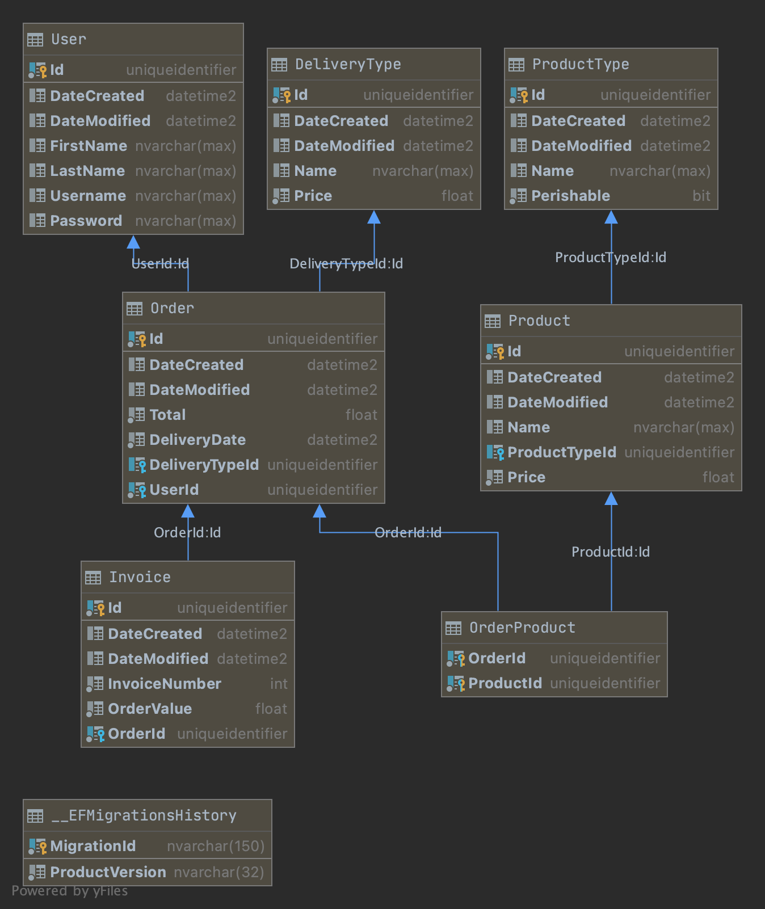
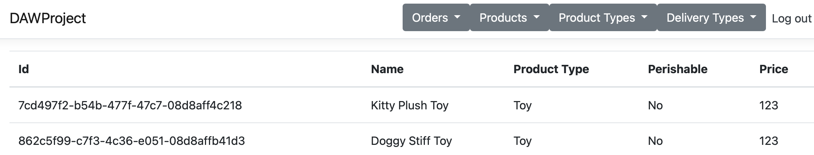
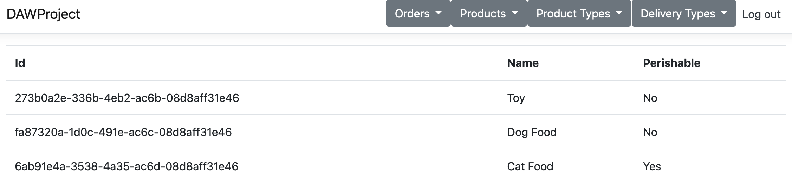
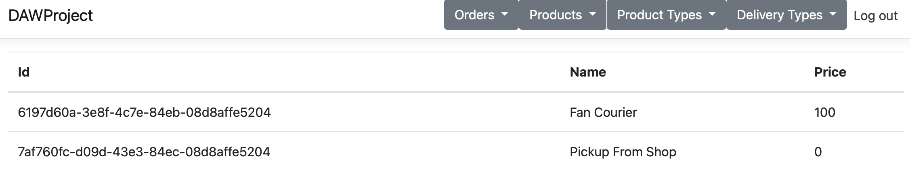
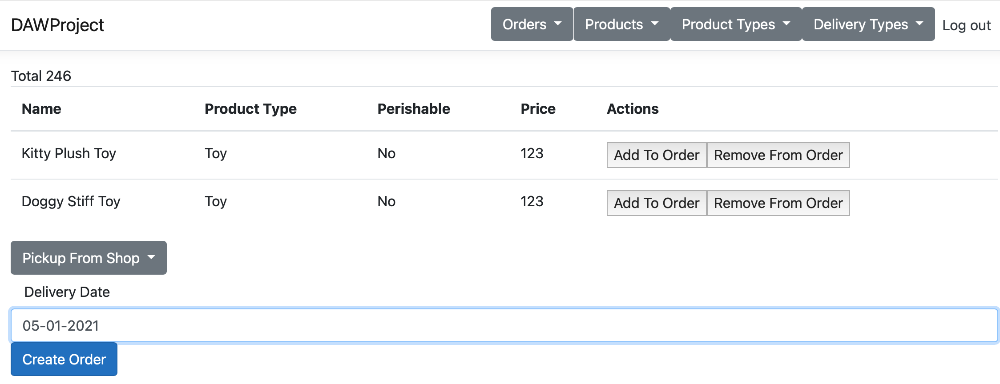
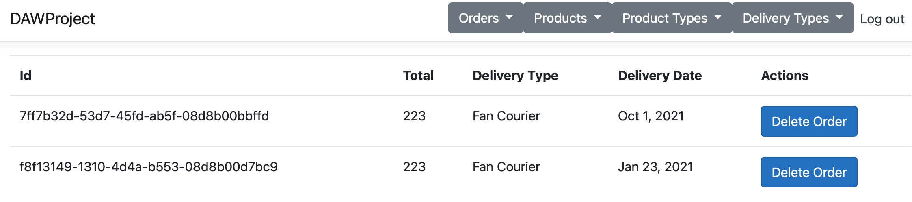

# Proiect-DAW
Proiect pentru cursul de dezvoltare a aplicațiile web

Pet Shop App

### Model

### Layers
#### Repositories
Layer-ul care se leaga la baza de date si furnizeaza toate operatiunile
necesare a fost abstractizat in clasa GenericRepository.
  
Ulterior, daca orice entitate are nevoie sa faca vreo operatie mai speciala
poate suprascrie oricare dintre metodele mostenite si reface functionalitatea.

#### Services

Toate clasele de tip serviciu exista cu scopul de a implementa
o logica de business in proiectul curent.
Pentru cateva dintre entitati, nu avem nevoie de altceva decat un API
pentru operatii CRUD, dar exceptie face OrderService care la fiecare creare
a unei comenzi, genereaza si o factura cu informatii bazate pe date din comanda.
  
#### Controllers

Controllerele expun un set standard de operatii pentru a satisface operatiile
CRUD pentru oricare dintre entitati.
  
Am implementat un mecanism care din nou sa generalizeze foarte mult din operatiile
care ar fi fost implementate in fiecare dintre controllere, iar acolo unde se face exceptie
sa se implementeze explicit functiile dorite.

### Exemple

#### Produse

#### Tipuri de Produse

#### Tipuri de Metode De Livrare

#### Formular Creare Comanda

#### Panoul cu Comenzile efectuate de utilizator

